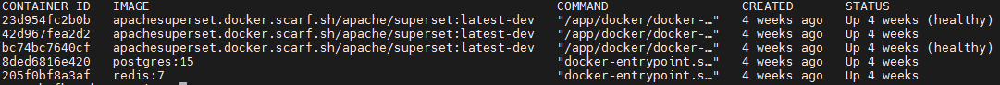

## KAFKA

Билд был взят на официальном сайте Apache Kafka. Версия 3.9.1
Деплой был произведен во внутренней сети университета через удаленный доступ с 1 брокером в KRaft режиме.
Используется 1 брокер ввиду ограниченности ресурсов и текущей ненадобности в отказоустойчивости. Проект все ещё находится в разработке. Многие вещи меняются и дорабатываются. Ввиду этого, количество брокеров может увеличиться.

Для удобства был интегрирован Kafka UI

Было добавлено два топика 
1. attendance_events - для сбора информации из электронного журнала посещения
2. attendance_enriched - для сбора обогащенной информации 

Оба топика имеют фактор репликации - 1, а также 1 партицию. Политика очистки - удаление

## SPARK 

Билд был взят на официальном сайте Apache Spark. Версия 4.0.0
Деплой был произведен во внутренней сети университета через удаленный доступ. Работа производится через оболочку PySpark (Python version 3.11.2)
См. spark.py

## CLICKHOUSE 

Деплой был произведен во внутренней сети университета через удаленный доступ. Версия 25.1.4.53.

## SUPERSET

Билд был взят на официальном сайте Superset и развернут через Docker-compose.yml файл 

Деплой был произведен во внутренней сети университета через удаленный доступ. 