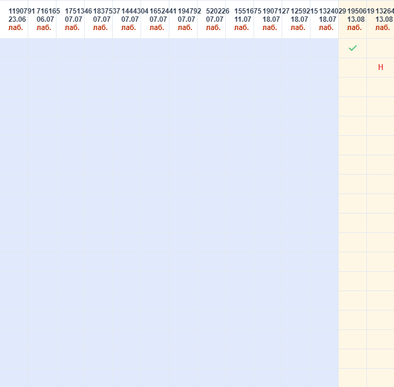
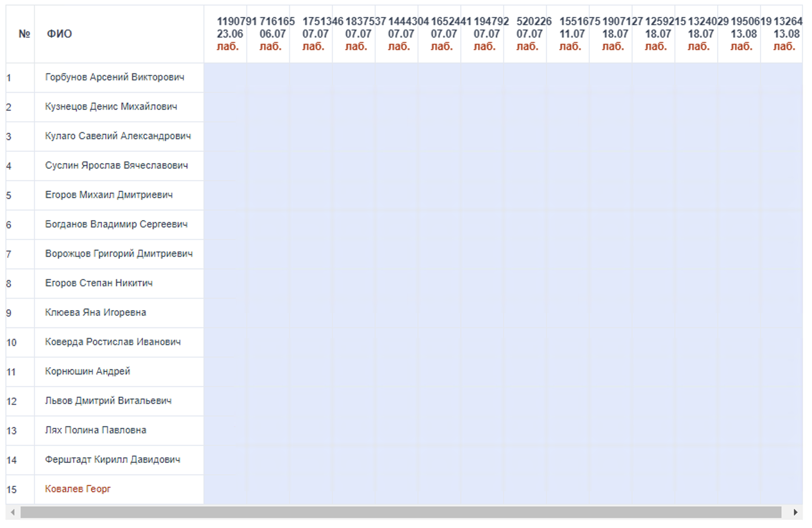
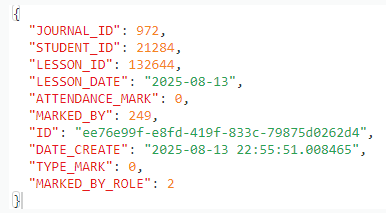
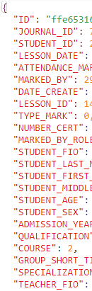

# Проект  
Информационная системы для обработки аналитических данных в образовательной организации

# Описание
Система обрабатывает данные посещаемости студентов: сбор через Kafka, обогащение в Spark Streaming из Elasticsearch, хранение в ClickHouse, визуализация в Superset. 

# Архитектура
- Kafka (2.13-3.9.1): Сбор и маршрутизация данных.
- Spark Streaming (4.0.0): Обогащение данными из Elasticsearch.
- ClickHouse (25.1.4.53): Хранение и аналитика.
- Superset (4.1.13): Дашборды.
- ElasticSearch (9.0.2): Хранение справочной информации о студентах и преподавателях.

# Описание работы проекта

Задача состояла в разработке системы обогащения данных из электронного журнала посещения. 
На паре преподаватель должен ставить отметки в специальном журнале.

При первом клике ставится отметка о присутствие студента, на следующий - отсутствие. 
На каждый клик система должна подтягивать как можно больше данных из различных источников информации университета. На текущий момент это - ElasticSearch. В обозримом будующем данные будут доставаться из CRM системы BITRIX, а также 1C.

В электронный журнал был интегрирован Kafka-producer, который отправляет данные в топик attendance_events.
После попадания данных в топик их начинает обрабатывать Spark Streaming.
Spark извлекает из записи уникальные ID студента и преподавателя, затем подключается к ElasticSearch для нахождения справочной информации о студенте и преподавателе. 
Джоинит сырые данные из журнала и справочную информацию и записывает в топик attendance_enriched.

### Сырые данные 

### Обогащенные данные (некоторые поля, ввиду конфиденциальности данных)

### 📌 Посмотреть, как отправляются данные из журнала можно [здесь](https://github.com/Kinnerul/gasu_enricher/blob/main/dependence/kafka/Description.md)

# Обогащение данных

После отправки данных в топик attendance_events, Spark Streaming обогащает сырые данные из журнала справочными данными из ElasticSearch о конкретном студенте и преподавателе, а затем отправляет сообщение в attendance_enriched

### 📌 Посмотреть, как обогощаются данные можно [здесь](https://github.com/Kinnerul/gasu_enricher/blob/main/dependence/spark/DeployAndDescrip.md)

# Хранение данных

Для хранения данных была создана таблица с дивжком KAFKA, которая подписана на топик attendance_enriched.

После появление сообщений в топике, через определенный интервал Clickhouse забирает батч и вставляет в таблицу attendance_enriched через материализованное представление.

### 📌 Список таблиц со всеми полями и некоторым описанием можно посмотреть [здесь](https://github.com/Kinnerul/gasu_enricher/blob/main/dependence/clichkouse/tables.md)

# Визуализация данных

Так как attendance_enriched хранит все исторические данные о кликах, то для корректной статистики необходимо сделать витрину, которая будет хранить только последние клики посещаемости, то есть актуальную информацию.

📌 Для этого, с помощью материализованного представления на основе движка ReplacingMergeTree по полю date_create таблица агрегируется при помощи функции argMax по тому же date_create, чтобы выбирать только последнюю запись

При помощи Clickhouse Driver было установлено соединение между Superset и Clickhouse.
Создан Dataset на основе latest_attendance_mv.

Было построено два дашборда по срезам по преподавателям и группам.

Ознакомиться с дашбордами можно 

### 📌 Визуализацию данных можно посмотреть [здесь](https://github.com/Kinnerul/gasu_enricher/blob/main/dependence/superset/visualization.md)
